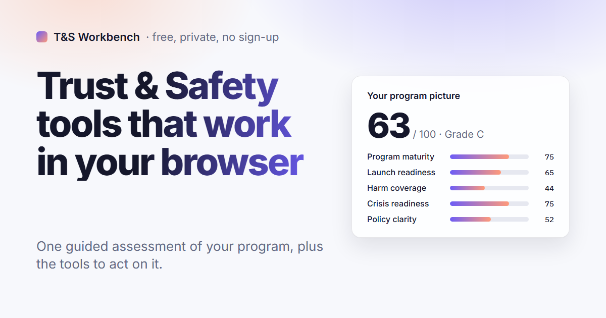
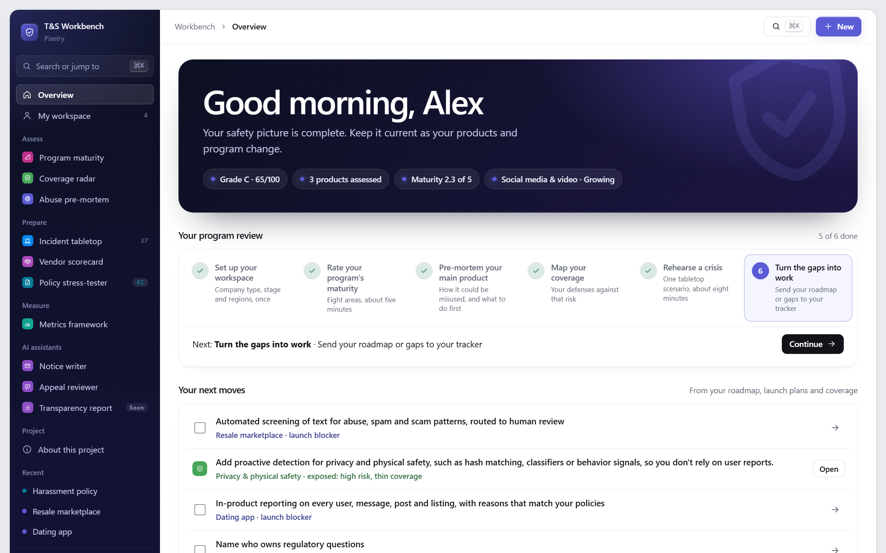
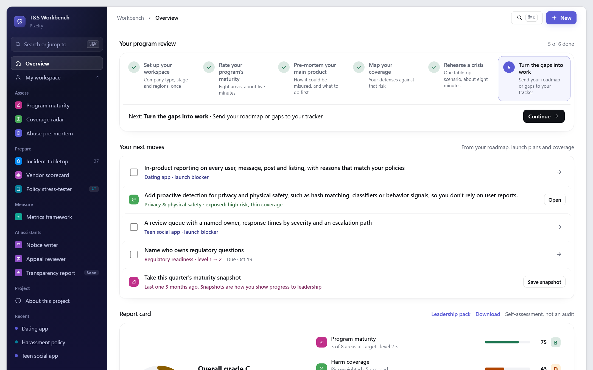
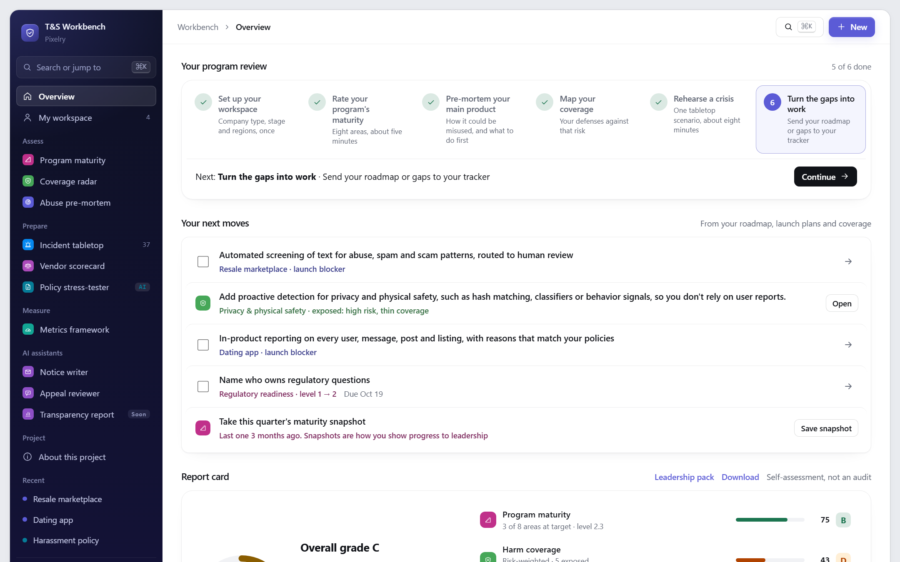
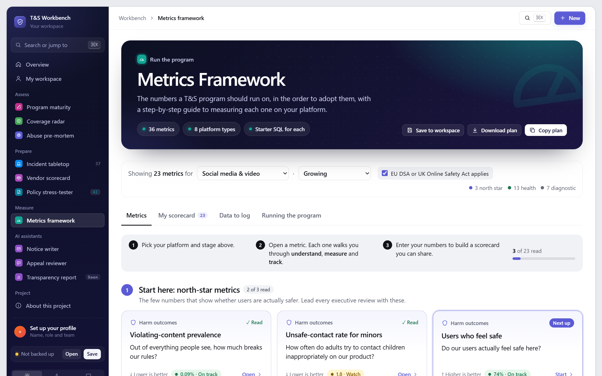
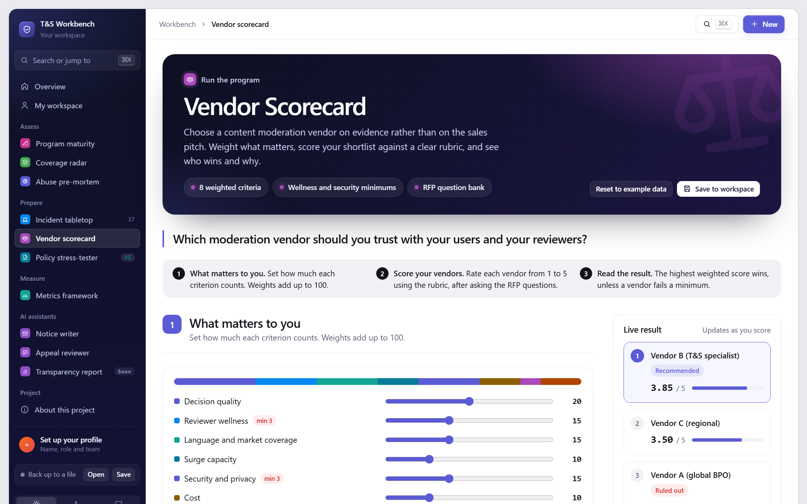
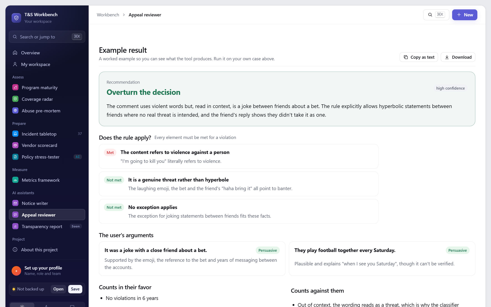
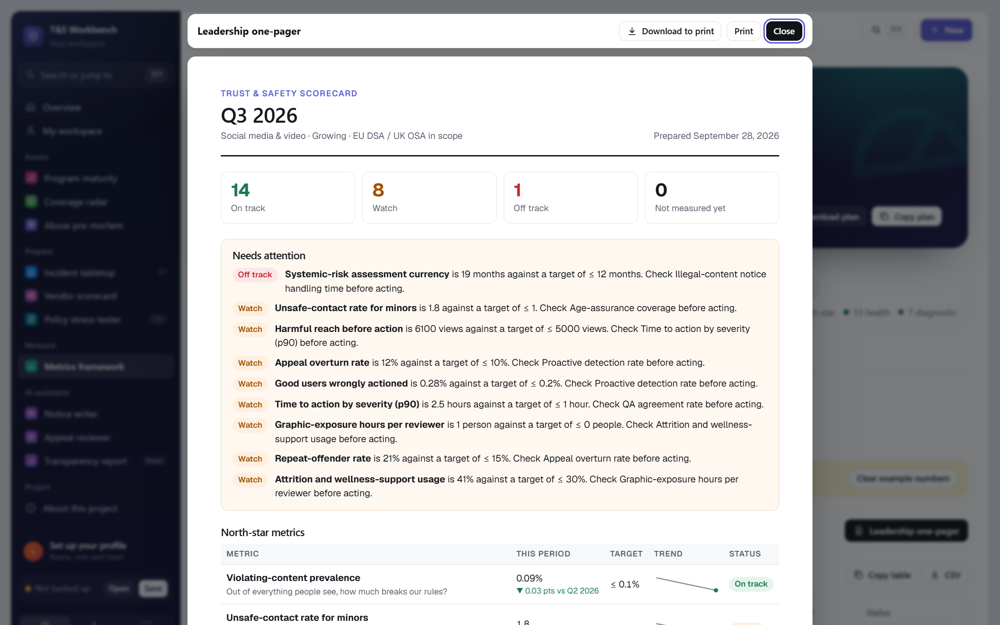
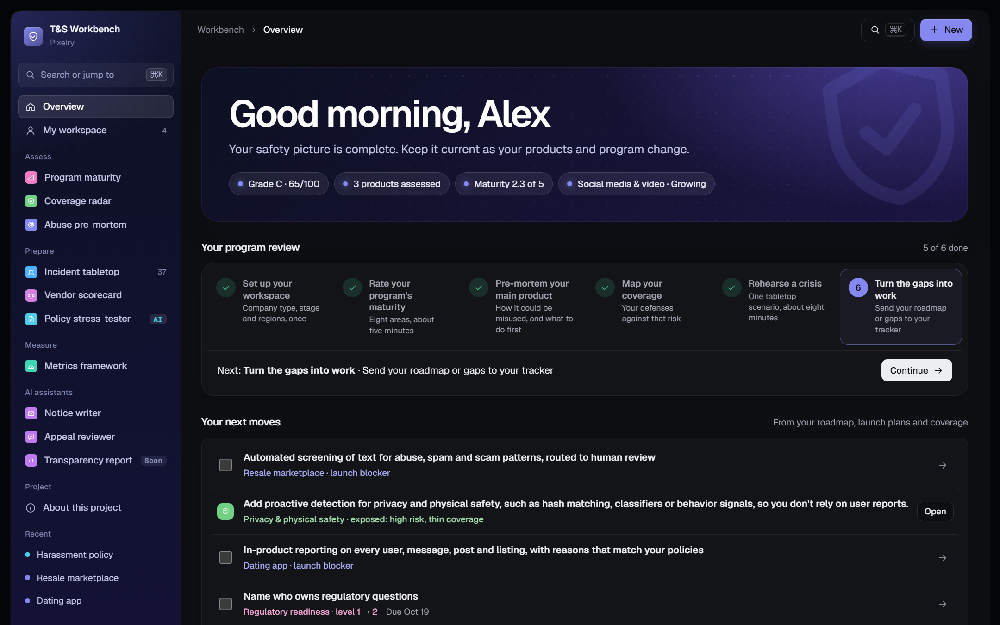

<p align="center"><a href="https://stevenmacchia.github.io/ts-workbench/"></a></p>

# T&S Workbench

Free, private tools that help Trust & Safety and product teams find risks before launch, rehearse incidents, measure what matters, choose vendors and write better policy.

**[Open the live site](https://stevenmacchia.github.io/ts-workbench/)** · no sign-up, and nothing leaves your browser

## The tools

| Tool | What it helps you do | Open content |
|---|---|---|
| **[Abuse pre-mortem](https://stevenmacchia.github.io/ts-workbench/#premortem)** | Profile a product and see how it will be misused before launch: 58 risks, 104 safeguards, 33 legal obligations in 7 jurisdictions. | [abuse-premortem](https://github.com/stevenmacchia/abuse-premortem) |
| **[Incident tabletop](https://stevenmacchia.github.io/ts-workbench/#tabletop)** | Rehearse a crisis: 37 scenarios across 8 company types, with a lesson and the law behind every call. | [incident-tabletop](https://github.com/stevenmacchia/incident-tabletop) |
| **[Metrics framework](https://stevenmacchia.github.io/ts-workbench/#metrics)** | The scorecard a T&S leader brings to an executive review: 36 metrics with formulas, measurement steps and SQL, plus trends and a one-pager. | [ts-metrics-framework](https://github.com/stevenmacchia/ts-metrics-framework) |
| **[Vendor scorecard](https://stevenmacchia.github.io/ts-workbench/#vendors)** | Choose a moderation vendor on evidence: 8 weighted criteria, rubrics, minimums and RFP questions. | [moderation-vendor-scorecard](https://github.com/stevenmacchia/moderation-vendor-scorecard) |
| **[Coverage radar](https://stevenmacchia.github.io/ts-workbench/#coverage)** | Rate five layers of defense for 8 kinds of harm and see them against your products' risk. | [harm-coverage-radar](https://github.com/stevenmacchia/harm-coverage-radar) |
| **[Program maturity](https://stevenmacchia.github.io/ts-workbench/#maturity)** | Rate a T&S program in 8 areas against the targets for its stage, and get a phased roadmap for the biggest gaps. | [ts-maturity-model](https://github.com/stevenmacchia/ts-maturity-model) |
| **[AI assistants](https://stevenmacchia.github.io/ts-workbench/#policy)** | Stress-test a policy, write an enforcement notice and review an appeal, on the user's own Claude account. A transparency report drafter is under construction. | [ts-ai-assistants](https://github.com/stevenmacchia/ts-ai-assistants) |



## Why it exists

Trust & Safety knowledge mostly lives in people's heads and in slide decks that don't travel between companies. Every new team rebuilds the same thinking from scratch, usually after something has already gone wrong. This project packages that thinking into tools a product manager, a founder or a new T&S hire can use today, and publishes the underlying knowledge as open content.

## Design principles

- **Private by default.** Everything is stored in the visitor's own browser, so teams can describe unreleased products freely. A workspace file carries it to any device: save it to a synced folder and open it anywhere.
- **Works with your tracker.** Launch plans and maturity roadmaps go to Jira, Asana or Linear as a CSV, or open as pre-filled Jira, Linear or GitHub issues, with no logins or tokens.
- **Plain language first.** Written for product managers and founders, with jargon explained on hover.
- **Every number explains itself.** Each risk score lists the answers that drove it; each metric names its guardrail.
- **Summary before detail.** Reports open with the handful of actions that matter most.
- **AI where it helps, with a person in charge.** The AI tools run on the visitor's own account, only on a click, and frame every result for human review.
- **Works everywhere.** Light and dark themes, keyboard navigation and layouts that work at phone width.

## Screenshots
















## How it's built

- **One HTML file.** No framework, no backend, no accounts. Source parts in [`src/`](src) are assembled by [`src/build-ws.js`](src/build-ws.js) into [`docs/index.html`](docs/index.html), which GitHub Pages serves.
- **Hash routing** gives every tool, tab and metric its own link, and a command palette (⌘K) reaches any tool, metric, scenario or saved result.
- **Automated checks** render every page for every platform, stage and regulation setting, play every tabletop scenario in every tailored version, verify scoring and status logic, and run each AI assistant against a stubbed model, including declined permission, rate limits and malformed output.

```bash
npm test      # builds, then runs every check
npm run build # rebuilds docs/index.html
```

## License and credit

Code is [MIT](LICENSE). The knowledge content (risks, safeguards, scenarios, metrics, rubrics and prompts) is [CC BY 4.0](LICENSE-CONTENT). Law notes are general information, not legal advice.

Built by [Steven Macchia](https://www.linkedin.com/in/stevenmacchia), Trust & Safety leader, with AI-assisted development (Claude).
